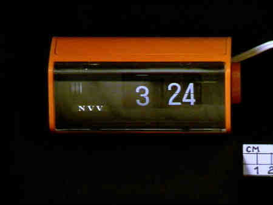

# INTELLECTUAL HISTORY AND FUTURE OF TIME
***Archive - Memory - Representation: Archival Resilience - Keeping Time***
> changes have occurred in the way which humans experience and measure time in accordance with our art, our science and our social infrastructure. 

---

## Table of contents
1. [ARTEFACT](#ARTEFACT)
1. [RESEARCH](#RESEARCH)
   *  [What is time?](#1-WHAT-IS-TIME?)
      * [1.1 Definition](#1.1-definition)
      * [1.2 facts about time](#1.2-facts-about-time)
      * [1.3 Questions about time](#1.3-questions-about-time)
      * [1.4 how is time defined in culture?](#1.4-how-is-time-defined-in-culture?)
   * [2 - NVV: Nederlands Verbond van Vakverenigingen](#2-NVV)
      * [2.1 Who was the NVV?](#2.1-who-was-the-nvv?)
      * [2.2 What is a vakvereniging/vakbond?](#2.2-What-is-a-vakvereniging/vakbond?)
        * [2.2.1 what was it then?](#2.2.1-what-was-it-then?)
        * [2.2.2 what is it now?](#2.2.2-what-is-it-now?)
1. [RESILIENCE OF THE ARTIFACT: TRANSCODING](#RESILIENCE-OF-THE-ARTIFACT-TRANSCODING)
   * [Ideas/Concepts](#ideas-concepts)
      * concept/main idea: Transcoding Tool
      * transcoding topics & possibilities
   * [TRANSCODING EXPERIMENTS](#transcoding-experiments)
      * [1 - TRANSCODING TOOL: Alarm clock website](#transcoding-tool)
        * 1.1 Website Sketches
          * 1.1.1 - winamp inspired control board
        * 1.2 Clock sketches
      * [2 - EXPLORING THE MATERIALITY](#exploring-materiality)
        * 2.1 - What does the clock look like?
        * 2.2 - Understandings of the clock - how does it tick?
      * [3 - TRANSCRIBING of TIME PERSPECTIVE](#transcribing-time-perspective)
        * 3.1 - Creating a channel for ASMR representing different (cultural) notions of time
        * 3.2 - Creating an additional channel which visually represents notions of time (but without audio)
1. [REFLECTION](#REFLECTION)
1. [OUTCOME](#OUTCOME)
    * Final Outcome: General Overview
    * Outcome Links
1. [CONCLUSION](#CONCLUSION)
1. [BIBLIOGRAPHY](#BIBLIOGRAPHY)
    * [EXTRA SOURCES/REFERENCES](#extra-sources-references)

---

#  1. ARTEFACT

*This artefact is an orange flip-alarm clock that was possibly handed out by the NVV union in between 1950 and 1974. There is a chance that this item was given to the NVV members at the time as some sort of gift, however this is speculation rather than known facts.*

 
  
 ARTEFACT IISG LINK - IISG 

  
https://iisg.amsterdam/en/detail?id=https%3A%2F%2Fiisg.amsterdam%2Fid%2Fitem%2F576724

  <tr>
    <th>Information Archive: </th>
  </tr>
</table>

<table style="width:100%">
  <tr>
    <th>NVV </th>
    <th>ALARM CLOCK</th> 
  </tr>
  <tr>
    <td>IISG call Number</td>
    <td>IISG BG K21/816 </td>
  </tr>
  <tr>
    <td>physical description</td>
    <td>NVV electric alarm clock</td>
  </tr>
  <tr>
    <td>Type</td>
    <td>Object</td>
  </tr>
   <tr>
    <td>Medium</td>
    <td>Alarm Clock</td>
  </tr>
   <tr>
    <td>Materials</td>
    <td>Plastic</td>
  </tr>
   <tr>
    <td>Location of Origin</td>
    <td>the Netherlands</td>
  </tr>
   <tr>
    <td>Date</td>
    <td>1950-1974 </td>
  </tr>
  <tr>
    <td>  </td>
    <td> An orange colored, retro-flip alarm clock, with an NVV logo on it. There is a turning button on the right side. The         time that it stopped on is 3.24PM and the clockface of the alarm is black colored with white typography.</td>
  </tr>
</table>

---

&nbsp;

#  2. RESEARCH

##  1) WHAT IS TIME?

###  1.1 DEFINITION

Time = the indefinite continued progress of existence and events in the past, present, and future regarded as a whole

###  1.2 "FACTS" ABOUT TIME
 
Standart time = globally accepted standart of time measurement >> 

SI system = Seconds are the base unit in this system [1](#1)

<table> 
  <tr>
    <td>  </td>
    <td> - *minute* (60 seconds)
- *hour* (60 minutes, or 3,600 seconds)
- *day* (24 hours, or 86,400 seconds)
- *week* (7 days, or 604,800 seconds)
- *month* (28-31 days, or 2,419,200-2,678.400 seconds)
- *year* (about 365.25 days, or about 31,557,600 seconds) </td>
   </td>
 </table>
 
- *minute* (60 seconds)
- *hour* (60 minutes, or 3,600 seconds)
- *day* (24 hours, or 86,400 seconds)
- *week* (7 days, or 604,800 seconds)
- *month* (28-31 days, or 2,419,200-2,678.400 seconds)
- *year* (about 365.25 days, or about 31,557,600 seconds)

For even longer periods, some multiples of years are commonly used, e.g. *decade* (10 years), *century* (100 years), *millennium* (1,000 years), *mega-anuum* (1,000,000 years), etc.

#### *System Time*

*System time* on a computer is measured by a system clock, which is typically implemented as a simple count of the number of “ticks” that have transpired since some arbitrary starting date, called the epoch. *Several variations of *metric time* are used in computing. The widely-used *UNIX time* is defined as the number of seconds elapsed since 00:00:00 UTC on 1 January 1970. Microsoft’s *FILETIME* uses multiples of 100ns since 1 January 1601. *OpenVMS* uses the number of 100ns since 17 November 1858, and *RISC OS* use the number of centiseconds since 1 January 1900. Most computers use the *Network Time Protocol* (NTP), one of the oldest Internet protocols used to coordinate computer clocks to Coordinated Universal Time (see above). [2](#2)

###  1.3 QUESTIONS ABOUT TIME

1. **How can you take the concept of time and transcode it into a visible understandable concept?**
    - alarm clock
    - clock
    - phone
    - timer
    - stopwatch
    - sun
2. **what is the cultural implication of time?**
    - think about a western country and a country like cuba.
3. **What is time when you’re deaf?**
    - Hand signs for time
4. **What is the concept of time?**
    - REFERENCE MOVIE LUCY : Time is the only true unit of measure. It gives proof to the existence of matter. Without time, we don't exist.

###  1.4 HOW IS TIME DEFINED IN CULTURE? [3](#3)

<table>
   <tr>
    <th>Influences</th>
    <th>How are these prevalent?</th>
  </tr>
  <tr>
    <td>Time-orientated</td>
    <td>
→ future

→ present

→  past 
orientated cultures</td>
  </tr>
  <tr>
    <td>Pre-industrial cultures</td>
    <td>- pirahã tribe from Amazone
      
- hopi tribe Arizona

- Kapauku tribe-papua new guinea (hunters and gatherers) </td>
  </tr>
    <tr>
    <td> Chronemics</td>
    <td> 
study of the use of time and the way that time is perceived and valued by individuals and cultures, particularly as regards non-verbal communication. These time perceptions include things like punctuality, willingness to wait, approaches to face-to-face interactions, and reactions to time pressure. </td>
  </tr>
    <tr>
    <td> Economics and time </td>
    <td> wealthy societies tend to move faster</td>
  </tr>
    <tr>
    <td> Industrialisation </td>
    <td> from time surplus TO time affluence TO time famine society </td>
  </tr>  
  <tr>
    <td>Climate & time </td>
    <td> hotter countries are more slow pace </td>
  </tr>
    <tr>
    <td> Individualistic vs social oriented </td>
    <td>time-is-money vs enjoying life </td>
  </tr>
   <tr>
    <td> Time discipline </td>
    <td> field in sociology linked to time analysis with regards to culture </td>
  </tr>
  <tr>
    <td>Time and religion </td>
    <td> the rule of st. Benedict introduced canonical hours > this implemented new factors into time analysis other then biological or astrological  </td>
  </tr>
  <tr>
    <td>Time and language </td>
    <td>different concept of time in different languages </td>
  </tr>
  
</table>

---

###  2) NVV: NEDERLANDS VERBOND VAN VAKVERENIGINGEN
####  2.1 Who was the NVV?
 
The Dutch Union of the NVV was a trade union, founded on the 1st of Januari 1906 by the 15 unions. The NVV later (1977) united with the Dutch Catholique Union to become the FNV. 

The NVV was the trade union of the social democratic pilar. The founding of the NVV happened after the railroad strikes of 1903. The first chair, Henri Polak, was simultanuously the chair of the General Dutch Diamond Union. The NVV has been in national socialistic hands from the beginning of World War 2 in 1942. [4](#4)

####  2.2 What is a vakvereniging/vakbond?

#####  2.2.1 what was it then?

A Union is an organization that takes into consideration and represents the individual and collective intersts of employees. 
The first national union in the netherlands was the General Dutch Employee Union in 1871. The political influences within these national unions resulted into the founding of independent unions, such as the NAS in 1893. 

The first "modern" (social-democratic) union in the Netherlands was the Diamond Union in 1894. On the first of januari 1906 the NVV was founded out of 15 other unions. 

In 2001 was 25% of the Dutch employees (between the ages of 15 - 64 years) were members of a union. In 2013 it was 1.8 milion people. 

---

#####  2.2.2 What is it now?

Vakbonden in Nederland

Explanations about unions in general in the netherlands, and how they functioned can be found in the following source: [5](#5)

 ####  2.3 Vakverenigingen and the distribution of the work week

- 30 hour workweek (Now being implemented in some areas of the world) VS 48 hour workweek
- the weekend
- 9 to 5
- lunch hour
etc.

---

#  3. RESILIENCE OF THE ARTIFACT: TRANSCODING
##  IDEAS/CONCEPTS
### CONCEPT/MAIN IDEA: TRANSCODING TOOL

**INFORMATION TRANSCODING TOOL** | CLOCK WEBSITE
------------ | -------------
 *description:* | Creating this main page that will be a digital visualization of the clock, taking the materiality of the clock into consideration and using the research on time and NVV as visualizations of this digital clock.
 *aims:* | showing how the NVV (vakbonden in general maybe) have had an impact on how we understand the concept of time. 
 *methods:* | Building a website that is a visual translation of this clock + additional smaller transcodings 
 *Source Link:* | link to my transcoding tool >>> coming soon!
 
 
*REFERENCE: WINAMP, and their skins > each skin could be a different transcoding of the clock. These could be linked by clicking on certain things/buttons on the page*

---

  
 Transcoding topics/possibilities 

#### 1) linear vs cyclical time perception [6](#6), [7](#7), [8](#8).
1. LINEAR TIME = past, present future only exists once
1. CYCLICAL TIME = repetitions of periods

#### 2) time-orientation

- past
- present
- future

Cultures can be orientated/focused mostly on either of these concepts, which affects the way people perceive time within that culture

>> example: when there is a past/present orientation, there is often a more chilled perception whereas in a future orientated culture (like most western cultures) there is a stricter concept of time. 

Questions that I could answer with transcoding:

- What would a western world look like if we would be more past/present orientated?
- What changes would occur?

#### 3) Calendars as a social construct

Calendars are a socially constructed way to measure time; what if I analize the differences between calendars and create my own for the future 

Question to keep in mind?

- what would time look like in a future where more and more things become digitalized (if not our entire lives?) (think about places where no digitalization has happened at al, such as in tribes, cults and islands)

#### 4) the concept of deja-vu culturally?

#### 5) analysing chronemics (in netherlands vs greece)

[amazoneaws.com](https://s3-us-west-2.amazonaws.com/secure.notion-static.com/34d6c4ca-c5b5-47de-9d75-0f3043193643/Screenshot_2020-04-19_at_16.47.32.png)

#### 6) times in corona period - fast pace vs slow down?

#### 7) Creating a toolkit to recreate the clock of the NVV

→ Ikea manual to recreate the clock, with fun quotes/facts about time and worklife

#### 8) time and sound / image  

→ we link certain sounds (like birds chierping, alarm clocks, lunch bells, the news jingle) with certain times in the day

Create a video that combines sounds of time/ videos of time to their period in the day

1) sounds with time

2) videos with time

>>> this could be a series of videos, where maybe I could explore different cultures as well! 

- time in Netherlands
- time in Greece

 

---

  
 Extra possible transcoding ideas

1. working with the concept of sound and how it represents time
1. working with the concept of circularity > everyday we have a certain schedule (ex: breakfast-lunch-dinner) but we are never in the same place and same time in space.
1. working with the concept of time passing faster and slower > timelapse video's?
1. working with different cultures and their perception of time
1. Working in Corona time VS Working in regular time 
1. Taking time idoms and making a game out of them

---

##  TRANSCODING EXPERIMENTS

###  1)  TRANSCODING TOOL: Alarm clock website
#### WEBSITE SKETCHES
##### 1.1.1 - Winamp inspired control board

*>>> need the skin/website to look more like the original clock, but not to exactly copy it! HOW?*
1. make sure there is more of a visual link to the original clock
2. ensure a reference to the NVV and the evolution of work and time

#### 1.2 - CLock Sketches
##### Alarm clock - flipping effect

---

###  2) EXPLORING THE MATERIALITY

#### 2.1 - What does the clock look like?

- measurements: roughly 12 cm width x 5 cm height
- colours: clock: orange and black, typography: white
- text: NVV
- numbers: 3:24

#### 2.2 - Understandings of the clock - how does it tick?

Creating an IKEA-catalogue that combines a how-to alarm clock with quotes/facts about time??

---

###  3) TRANSCRIBING of TIME PERSPECTIVE

#### 3.1 - Creating a channel for ASMR representing different (cultural) notions of time

##### >>> website sketch

##### >>> audio trials
*trial 1*  - sounds of a day: MORNING TIME

*trial 2* - sounds of a day 2: WORK TIME

> These could later also maybe be other type of representations, like sounds of a workout, or sounds of having fun (and then playing with the concept of time flies when you're having fun) etc. 

#### 3.2 Creating an additional channel which visually represents notions of time (but without audio)
##### >>> website sketch

##### >>> video trials

*trial 1* - MORNING TIMES

&nbsp;

#  5. REFLECTION

#  6. OUTCOME
## Final Outcome: General Description
## Outcome Links

#  7. BIBLIOGRAPHY

 [1] [https://s3-us-west-2.amazonaws.com/secure.notion-static.com/3b6980fc-bfea-4422-8c14-a92f141f5e9f/Untitled.png](https://s3-us-west-2.amazonaws.com/secure.notion-static.com/3b6980fc-bfea-4422-8c14-a92f141f5e9f/Untitled.png)

 [2] [Unix Time Stamp - Epoch Converter](https://www.unixtimestamp.com/)

 [3] [Time in Different Cultures](http://www.exactlywhatistime.com/other-aspects-of-time/time-in-different-cultures/)

 [4] [Wikipedia nvv](https://nl.wikipedia.org/wiki/Nederlands_Verbond_van_Vakverenigingen)

 [5] [https://nl.wikipedia.org/wiki/Lijst_van_vakbonden_in_Nederland](https://nl.wikipedia.org/wiki/Lijst_van_vakbonden_in_Nederland)

 [6] [amazoneaws.com part1](https://s3-us-west-2.amazonaws.com/secure.notion-static.com/2772ec6b-4cab-4459-9bf8-224dd776be1d/Untitled.png)

 [7] [Is Time Linear or Cyclical?](https://www.theperspective.com/debates/living/perspective-time-linear-cyclical/)

 [8] [amazonaws.com part2](https://s3-us-west-2.amazonaws.com/secure.notion-static.com/2239e4fa-a096-45ad-9959-807f57f41b7b/Screenshot_2020-04-19_at_12.56.35.png)

##  EXTRA SOURCES/REFERENCES

[1] [Wikipedia Werkweek](https://nl.wikipedia.org/wiki/Werkweek_(arbeid))

[2] [History of workhour reduction](https://www.denktankminerva.be/analyse/2018/4/30/een-kleine-geschiedenis-van-de-arbeidsduurvermindering)

[3] [Reduction of the workhours](https://www.google.com/search?q=vakverenigingen+en+de+verdeling+van+de+werkweek&rlz=1C5CHFA_enNL878NL878&oq=vakverenigingen+en+de+verdeling+van+de+werkweek&aqs=chrome..69i57.16421j0j4&sourceid=chrome&ie=UTF-8)

[4] 
[5] 

[6] [time as a social construct](https://www.everydaysociologyblog.com/2016/11/the-social-construction-of-time.html) 

[7] [shilpagupta art installation kassel](https://shilpagupta.com/i-keep-falling-at-you/)

[8] [Workings of a flip clock](https://www.flipclockfans.com/forum/articles/176-how-does-a-flip-clock-work-a-look-at-a-flip-clock-mechanism)

[9] [opstap naar moderne vakbeweging](https://www.vakbondshistorie.nl/dossiers/de-opstap-naar-de-moderne-vakbeweging/) 

[10] [Visual representations of time](https://en.wikibooks.org/wiki/Visual_Rhetoric/Visual_Representations_of_Time_and_Space)

[11] [Visualizations of time - data series](https://humansofdata.atlan.com/2016/11/visualizing-time-series-data/)

[12] [Visualizations of time youtube video](https://www.youtube.com/watch?time_continue=56&v=gtV7P620FVw&feature=emb_logo)

&nbsp;

